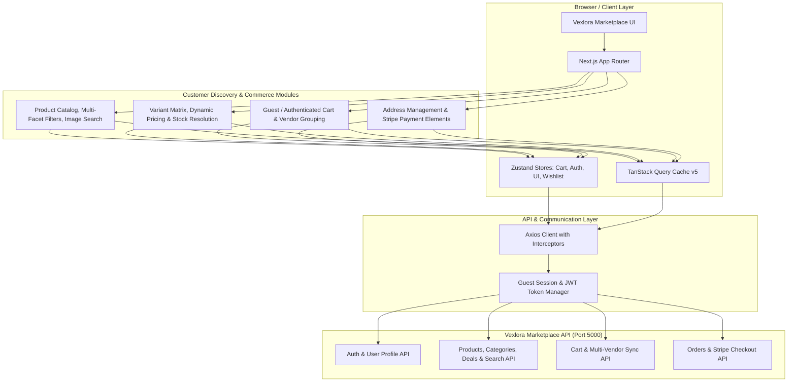

# Vexlora — Customer Marketplace Website

[](https://nextjs.org/)
[](https://react.dev/)
[](https://www.typescriptlang.org/)
[](https://tailwindcss.com/)
[](https://tanstack.com/query)
[](https://zustand-demo.pmnd.rs/)
[](https://stripe.com/)

**Vexlora Website** is the high-performance, customer-facing frontend for the Vexlora multi-vendor e-commerce ecosystem. Built on **Next.js App Router**, **React 19**, **TypeScript**, and **Tailwind CSS v4**, the application delivers a marketplace shopping experience featuring multi-attribute variant resolution, guest-to-authenticated cart synchronization, vendor-grouped checkout, AI image search integration, and Stripe Elements payments.

---

## 🏗️ System Architecture



---

## ✨ Implemented Core Features

### 🛍️ Marketplace Discovery & Navigation
* **Dynamic Landing Page**: Responsive hero banner, real-time Flash Deals carousel, and category grid matrix.
* **Product Catalog (`/products`)**: Paginated product grid with real-time sort options (price low-to-high, price high-to-low, newest arrivals, top rated).
* **Multi-Facet Filter Sidebar**: Multi-attribute filtering across category hierarchy, brand selection, dynamic price range sliders, minimum star ratings, and in-stock availability toggles.
* **Keyword & Semantic Search (`/search`)**: Dedicated search submission workflow optimizing API roundtrips, with empty state suggestions and active filter badges.
* **AI Visual / Image Search**: Drag-and-drop or image upload search drawer (`ImageSearchDropdown`) allowing visual product discovery.
* **Today's Hot Deals & Flash Sales (`/deals`)**: Countdown-driven promotion hub with discounted pricing badges and direct deal checkout.
* **Coupons Marketplace (`/coupons`)**: Interactive voucher center displaying platform and vendor-specific discount codes with copy-to-clipboard redemption.

### 📦 Advanced Product Detail Experience (`/products/[slug]`)
* **Multi-Attribute Variant Matrix**: Real-time attribute selection (e.g., Size, Color, Material) with automatic combinatorial variant matching.
* **Dynamic Price & Inventory Evaluation**: Instant updates to unit price, discount pricing, SKU, and available inventory based on selected variant combinations.
* **Interactive Media Gallery**: Full-width active image viewport with thumbnail carousel, zoom preview, and fallback handling.
* **Stock Constraint Guardrails**: Dynamic quantity counter enforcing available stock boundaries, disabling checkout on out-of-stock variations.
* **Mobile Sticky Purchase Bar**: High-converting sticky bottom drawer on mobile viewports presenting variant selections and quick "Add to Cart".
* **Rich Product Tabs & Reviews**: Detailed markdown specifications, shipping policies, vendor badge details, and an interactive customer review submission modal (`WriteReviewModal`).
* **Related Products Carousel**: Algorithmic recommendation carousel matching current category and vendor tags.

### 🛒 Multi-Vendor Cart & Checkout Engine (`/cart`, `/checkout`)
* **Guest-to-Authenticated Cart Transition**: Unauthenticated shoppers utilize local session IDs (`vexlora_cart_session_id`) stored in `localStorage`; upon login or registration, the frontend automatically merges guest items into the authenticated account.
* **Vendor-Grouped Cart Architecture**: Cart items are categorized under their respective vendor stores (`ApiVendorGroup`), enabling individual vendor subtotals and vendor-level selections.
* **Granular Item Selection**: Amazon/Lazada-style checkbox toggles allowing buyers to check out specific items or entire vendor groups while keeping others in the cart.
* **Saved for Later**: Seamless toggle moving items out of the active checkout tally into a persisted "Saved for Later" shelf.
* **Interactive Slide-Over Drawer**: Global drawer (`CartDrawer`) with optimistic item quantity manipulation, inline item removal, and subtotal recalculation.
* **Stripe Payment Elements Integration**: Multi-step checkout form collecting verified shipping addresses, applying coupon vouchers, and embedding Stripe Elements for PCI-compliant card processing.
* **Order Confirmation (`/order-success`)**: Post-purchase confirmation page rendering order IDs, delivery address summaries, and tracking links.

### 👤 Customer Authentication & Account Management
* **Credentials Authentication (`/login`, `/register`)**: Token-based authentication storing JWT tokens with Bearer authorization headers.
* **Password Recovery & OTP Verification (`/forgot-password`, `/verify-otp`)**: Self-service account recovery workflows.
* **Wishlist Management (`/wishlist`)**: Zustand-persisted wishlist store with instant add/remove toggles and catalog sync.
* **Vendor Onboarding Gateway (`/vendor-apply`)**: Public merchant application portal enabling new sellers to register their store and submit KYC onboarding details.

---

## 🔄 Cart & Checkout User Flow

```
[ Unauthenticated Guest ]
        │
        ├──> Browse Catalog & Select Variants
        ├──> Add Items to Cart (Guest Session ID generated & cached)
        │
[ Customer Authentication ]
        │
        ├──> Customer Logs In / Registers
        ├──> `mergeGuestCart()` executes automatically
        │
[ Multi-Vendor Cart Review ]
        │
        ├──> View Vendor-Grouped Cart Items
        ├──> Select Target Items / Vendor Groups for Checkout
        ├──> (Optional) Move non-priority items to "Saved for Later"
        │
[ Checkout & Fulfillment ]
        │
        ├──> Select / Enter Shipping Address
        ├──> Apply Platform or Vendor Coupon Code
        ├──> Mount Stripe Payment Element
        ├──> Confirm Payment Intent
        │
[ Order Success & Fulfillment ]
        └──> Redirect to `/order-success?orderId=...` with Order Summary
```

---

## ⚙️ Frontend Engineering & Architecture

### 1. State Management & Server-State Synchronization
* **Server State (TanStack Query v5)**: Query key factory (`keys.ts`) coordinates declarative caching, window focus refetching, and automatic mutation invalidation for products, coupons, and orders.
* **Client State (Zustand v5)**: Lightweight persisted stores (`cart.store.ts`, `auth.store.ts`, `wishlist.store.ts`, `ui.store.ts`) handle optimistic UI updates and local persistence using `localStorage`.

### 2. Type-Safe API Layer & Interceptors
* Centralized Axios instance (`src/lib/api/client.ts`) configured with request interceptors injecting JWT Bearer tokens and guest session headers (`x-cart-session-id`).
* Standardized envelope interfaces (`ApiResponse<T>`, `ApiError`) providing end-to-end TypeScript type narrowing across all endpoints.

### 3. Form Validation & Data Integrity
* Forms powered by **React Hook Form** paired with **Zod** resolver schemas (`auth.schema.ts`, `address.schema.ts`, `newsletter.schema.ts`) to provide instant validation feedback, regex email verification, and prevent invalid payload dispatches.

---

## ⚡ Performance & UX Optimizations

* **Predictable Search Invalidation**: Keyword search triggers on explicit form submission rather than debouncing keystrokes to minimize redundant network roundtrips.
* **Optimistic Cart Updates**: Quantity modifications and item deletions reflect instantly in the client state before server confirmation, rolling back gracefully if the mutation fails.
* **Skeleton Screen System**: Bespoke skeleton loaders for home flash deals, product grids, filter sidebars, and product details preventing cumulative layout shift (CLS).
* **Next.js Image Optimization**: Responsive image dimensions and modern WebP/AVIF formats served with fallback placeholders.

---

## 🛡️ Security & Route Protection

* **Client Token Isolation**: User tokens are managed in memory and local storage, with authorization headers attached only to outgoing requests destined for the configured API origin.
* **Session Persistence & Cleanup**: Centralized `logout()` in `auth.store.ts` purges authentication tokens, user profile caches, and invalidates active cart sessions.
* **Protected Checkout Routes**: Checkout flows verify session authentication before initializing Stripe Payment Intents.

---

## 📋 Comprehensive Testing & Verification Matrix

| Feature / Flow | Test Scenario | Expected Result | Status |
| :--- | :--- | :--- | :--- |
| **User Authentication** | Login with valid customer credentials | JWT stored, store updated, user header state reflects authenticated user | **Verified (Manual E2E)** |
| **Auth Session Persistence** | Refresh browser while logged in | Session restored from storage; user profile revalidated via `/users/me` | **Verified (Manual E2E)** |
| **Product Discovery** | Filter by Category, Price Slider, and In-Stock | URL search params update, product list refetches with matching dataset | **Verified (Manual E2E)** |
| **Search Submission** | Enter search keyword and submit form | Redirects to `/search?q=...` and renders matched product cards | **Verified (Manual E2E)** |
| **Variant Resolution** | Select Size 'XL' and Color 'Black' on PDP | Dynamic price, SKU, and stock count adjust to selected variant match | **Verified (Manual E2E)** |
| **Out-of-Stock Guard** | Select unavailable variant combination | "Add to Cart" button is disabled; displays "Out of Stock" state | **Verified (Manual E2E)** |
| **Guest Cart Creation** | Add product without authentication | Unique session ID assigned; item stored in local cart state | **Verified (Manual E2E)** |
| **Guest Cart Merging** | Add guest items, then log in | `mergeGuestCart()` merges guest items into user account cart | **Verified (Manual E2E)** |
| **Multi-Vendor Grouping** | Add items from 2 different vendors | Cart groups items under distinct vendor headers with group subtotals | **Verified (Manual E2E)** |
| **Selected Item Checkout** | Select 1 of 2 items in cart and proceed | Checkout order summary reflects only price of selected item | **Verified (Manual E2E)** |
| **Stripe Checkout** | Complete shipping details & card entry | Stripe Element confirms payment; redirects to `/order-success` | **Verified (Manual E2E)** |
| **Wishlist Persistence** | Toggle heart icon on product card | Item added to wishlist store; icon state persists across page navigation | **Verified (Manual E2E)** |
| **Type Integrity** | Execute full project typecheck (`pnpm typecheck`) | 0 TypeScript diagnostic errors across all pages and components | **Verified (Automated)** |
| **Lint Standards** | Execute Next.js linter (`pnpm lint`) | 0 ESLint warnings or syntax rule violations | **Verified (Automated)** |

---

## 🧰 Tech Stack

| Technology | Purpose | Implementation Path |
| :--- | :--- | :--- |
| **Next.js 16.3.5** | Framework (App Router, Turbopack, SSR/CSR) | [`src/app/`](src/app) |
| **React 19.2.8** | UI Library & React Server Components | Core dependency |
| **TypeScript 5.x** | Static Type Safety & Interfaces | [`src/types/`](src/types) |
| **Tailwind CSS v4** | Modern Utility-First Styling System | [`src/app/globals.css`](src/app/globals.css) |
| **TanStack Query v5** | Server-State Caching & Invalidation | [`src/lib/query/`](src/lib/query) |
| **Zustand v5** | Global Client Stores & Storage Persistence | [`src/stores/`](src/stores) |
| **Stripe Elements** | Payment Gateway UI Components | [`src/app/checkout/`](src/app/checkout) |
| **React Hook Form** | Form State Management | [`src/schemas/`](src/schemas) |
| **Zod v4** | Schema Validation & Runtime Checking | [`src/schemas/`](src/schemas) |
| **Axios** | HTTP Client & Request Interceptors | [`src/lib/api/client.ts`](src/lib/api/client.ts) |
| **Lucide React** | Scalable UI Iconography | Shared components |
| **Sonner** | Modern Toast Notification Engine | Root layout provider |

---

## 📁 Project Structure

```text
vexlora/
├── src/
│   ├── app/
│   │   ├── (auth)/                  # Auth route group (login, register, forgot-password, verify-otp)
│   │   ├── cart/                    # Full-page multi-vendor cart view
│   │   ├── checkout/                # Checkout flow & Stripe Elements integration
│   │   ├── coupons/                 # Coupon vouchers browsing & redemption
│   │   ├── deals/                   # Flash deals & promotional campaigns
│   │   ├── order-success/           # Post-purchase order confirmation & tracking
│   │   ├── products/                # Catalog listing & [slug] PDP product detail view
│   │   ├── search/                  # Search results page with facet filters
│   │   ├── vendor-apply/            # Public seller onboarding application
│   │   ├── wishlist/                # Saved customer wishlist items
│   │   ├── layout.tsx               # Root application layout & provider orchestration
│   │   ├── loading.tsx              # Global loading skeleton
│   │   ├── error.tsx                # Error boundary with retry mechanisms
│   │   └── globals.css              # Design tokens and Tailwind CSS v4 setup
│   ├── components/
│   │   ├── cart/                    # Cart drawer & multi-vendor cart item cards
│   │   ├── home/                    # Hero banners, flash deals, category grids
│   │   ├── layout/                  # Header, Navbar, MobileNav, Footer
│   │   ├── products/                # Product cards, filter sidebars, sorting controls
│   │   ├── search/                  # Visual AI image search dropdown
│   │   └── ui/                      # Base buttons, badges, modals, input elements
│   ├── hooks/                       # Custom React hooks (useCart, useOrders, useProductDetails)
│   ├── lib/
│   │   ├── api/                     # Axios client, auth, cart, product API services
│   │   ├── query/                   # Query client, query key factory, QueryProvider
│   │   └── variants/                # Variant matrix combinatorial matching utilities
│   ├── schemas/                     # Zod schemas (auth, address, newsletter)
│   ├── stores/                      # Zustand stores (cart, auth, wishlist, ui, imageSearch)
│   └── types/                       # Shared TypeScript definitions (product, auth, common)
├── package.json
└── tsconfig.json
```

---

## 🌟 Engineering Highlights

1. **Deterministic Multi-Attribute Variant Resolution**: Implemented a combinatorial algorithm matching complex product options (e.g. Color + Size + Material) to specific SKU entities with real-time stock and price recalculation.
2. **Resilient Guest-to-User Cart Migration**: Seamless transition from guest browser sessions to authenticated accounts, preserving buyer intent across devices without losing cart contents.
3. **Vendor-Isolated Marketplace Checkout**: Advanced multi-vendor cart partitioning enabling item-level and store-level checkout selection with discrete vendor subtotals.
4. **Stripe Elements Payment Pipeline**: Embedded PCI-compliant Stripe checkout supporting address validation, voucher deductions, and automatic order creation upon payment confirmation.
5. **Zero-Layout-Shift Loading Architecture**: Built tailored skeleton loaders for high-density catalog, filter sidebar, and product detail components to ensure flawless Core Web Vitals.

---

## 🚀 Getting Started

### Prerequisites
* **Node.js**: `v20.x` or higher
* **pnpm**: `v10.x` or higher
* **Backend API**: Running instance of `e-commerce-backend` on port `5000`

### 1. Install Dependencies
```bash
pnpm install
```

### 2. Configure Environment
Create a `.env.local` file in the root directory:
```env
NEXT_PUBLIC_API_URL=http://localhost:5000/api/v1
NEXT_PUBLIC_SITE_URL=http://localhost:3000
NEXT_PUBLIC_STRIPE_PUBLISHABLE_KEY=pk_test_your_stripe_key
```

### 3. Run Development Server
```bash
pnpm dev
```
Navigate to [http://localhost:3000](http://localhost:3000).

### 4. Code Quality & Build
```bash
# Typecheck
pnpm typecheck

# Lint
pnpm lint

# Production Build
pnpm build
```
